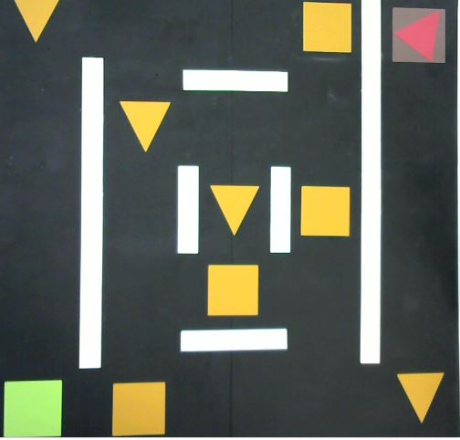
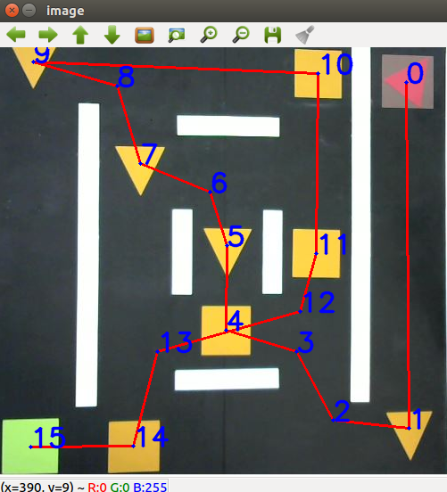
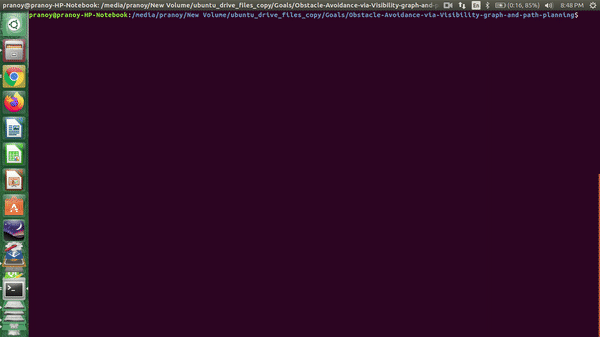
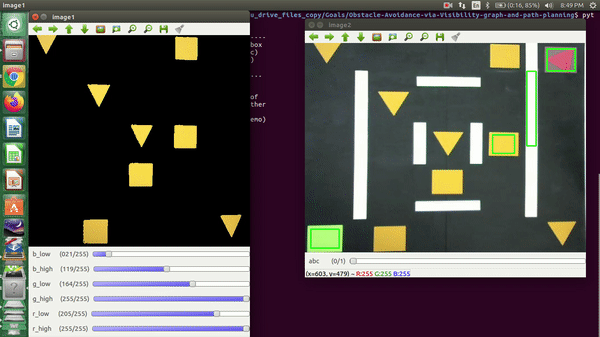

# Obstacle Avoidance via Visibility graph and path planning

| Input  | Result |
| ------------- | ------------- |
|   |    |

### Problem: 
Given the color specification of the start marker, end marker, other objects and obstacles, generate a path which connects the start and end marker while ensuring that all the other objects are visited and the obstacles are avoided.
(Note: Yellow blocks are objects to be visited, White blocks are the obstacles, Red block is the start node, Green block is the end node)

### My approach: 
I used the visibility graph concept to build a graph from the given image and then applied dijstra's shortest path algorithm to generate the path.

Visibility-graph is a graph of inter visible locations, typically for a set of points and obstacles in the Euclidean plane. Each node in the graph represents a point location, and each edge represents a visible 
connection between them. That is, if the line segment connecting two locations does not pass through any obstacle, an edge is drawn between them in the graph.

### Demo of the software:
Below are the instructions to use the software.
1. Name the image to be used for planning to be input.JPG.
2. For the purpose of getting a threshold of the color for different kinds of objects, follow these sub-instructions. (to crop, first select the object by drawing a bounding box then press 'c' to store the cropped image, and press esc)
- First crop out the start marker(whichever color it is)
- Crop out the white colored obstacles
- Crop out the yello objects which need to be visited before reaching the end marker.
- Crop out the end marker(whichever color it is) 
- Then use the trackbar window to fine tune the colors of the objects. After doing that, toggle the button on other window to switch to the next object.

(Please have a look at below given demo)



## Requirements:
1. Python 2.7+ 
2. [NumPy](http://www.numpy.org/)
3. [OpenCV](https://docs.opencv.org/4.5.2/index.html)

Or you may run the following commands in shell to install the required packages:
```shell
git clone https://github.com/pranoy-panda/Obstacle-Avoidance-via-Visibility-graph-and-path-planning.git
cd Obstacle-Avoidance-via-Visibility-graph-and-path-planning/
sudo pip install -r requirements.txt
```
## To get results on the provided [Image](../imgs/input.JPG), execute the following inside the repository:
```shell
python src/final_code.py
```

